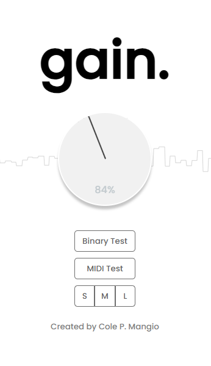

# IPlugWebEmbed
By Cole P. Mangio

### What is this
Based on this example project.
https://github.com/iPlug2/iPlug2/tree/master/Examples/IPlugWebUI

A fairly basic, portable, web-based gain audio plugin based on the iPlug2WebUI example project. I found that resource access via main.rc for specifically vst3 builds on windows (visual studio), introduced problems. 
Resource embedding works fine for application builds, but not for vsts for some reason. As a temporary solution to embedding my web resources into a standalone
audio plugin, I've come up with a hacky solution: embed web resources such as .htmls, .css, .js, .ttfs, .pngs, etc into a singular base64 html data uri and store it in a header file via a python script run during the pre-build stage. Then, simply load the uri into iPlug's webview. 

Soon I will add an 'other' folder where you can store other resources such as audio files, which could be
great for impulse response/convolution plugins if you want to embed default audio files. 



### File Structure
Your web page resources are located in resources/web. There you will see the following structure: <br>
```
📁resources/web
│    index.html
│    embed-web.py
│
└───📁scripts
│   │   webaudio-controls.js
│   │   network-hub.js
│   │   client.js
│   │   event-prevents.js
│   │   visualizer.js
│   
│   
└───📁styles
│   │   stylesheet.css
│   
│   
└───📁fonts
│   │   Poppins.ttf
│   
│      
└───📁images
│   │   test.jpg
│     
│      
└───📁embeds  // header files are auto generated/updated by the embed-web.py script 
    │   EmbeddedWeb.h
```

### Building the Embed Header
simply running ``` python embed-web.py ``` will compile all resources into a single base64 html data uri string stored in the EmbeddedWeb.h header. But again, you don't have to do this all the time, you can just build the solution in visual studio and it will run it via the pre-build.bat script.

### ! Note !
This is not 'good' solution. It is hacky, and can introduce problems. This solution was only built as a temporary solution so I could experiment with DSP with a portable Web UI on my windows system. Otherwise, it does 'work' and is indeed standalone.
